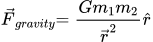
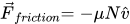
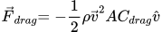

# API

This document contains all information on `renature`'s public facing API.

## Hooks

`renature`'s hooks form the core of the API. Every hook in `renature` takes the same set of parameters, although the physics `config` options depend on the specific force being used.

### Shared Parameters

| Property              | Type                                        | Description                                                                                                                                                                                                                                                   |
| --------------------- | ------------------------------------------- | ------------------------------------------------------------------------------------------------------------------------------------------------------------------------------------------------------------------------------------------------------------- |
| `from`                | `{ [key: keyof React.CSSProperties]: any }` | The CSS property or properties you're animating **from**. Accepts an arbitrary number of key-value pairs.                                                                                                                                                     |
| `to`                  | `{ [key: keyof React.CSSProperties]: any }` | The CSS property or properties you're animating **to**. Accepts an arbitrary number of key-value pairs.                                                                                                                                                       |
| `config`              | `object`                                    | Optional. The physics parameters used to model the selected force. This varies from force to force. See [Config](#config) below for specific force paramters. If no `config` is supplied, a default set of physics parameters will be supplied by `renature`. |
| `pause`               | `boolean?`                                  | Optional. Instructs `renature` to pause the animation on initial mount. If `true`, the animation will not run until `controller.start` is called or until a re-render occurs and `pause` evaluates to `false`. Defaults to `false`.                           |
| `delay`               | `number?`                                   | Optional. Instructs `renature` to delay the start of the animation by the provided number of milliseconds. Defaults to `undefined`.                                                                                                                           |
| `infinite`            | `boolean?`                                  | Optional. Instructs `renature` to restart the animation in the reverse direction when the animation completes in the forward direction, producing a "yoyo" effect. Defaults to `false`.                                                                       |
| `onFrame`             | `(progress: number) => void`                | Optional. Supply a callback function that `renature` will execute on every call to `requestAnimationFrame`.                                                                                                                                                   |
| `onAnimationComplete` | `() => void`                                | Optional. Supply a callback function that `renature` will run when your animation has completed. If the animation is unmounted before completing, `onAnimationComplete` _will not_ be called.                                                                 |

### Config

Each hook in `renature` accepts a `config` object for tweaking the physics parameters of the underlying simulation. These vary force by force.

### useGravity Config

The force of gravity is modeled using Newton's Law of Universal Gravitation. We use the real value of **G**, the Universal Gravitational Constant, approximated to 6.67428 x 10^-11.



The physics parameters used to tweak the `useGravity` animation include the following:

| Property        | Type     | Description                                                                                                                                                                                                                                                                                                                         |
| --------------- | -------- | ----------------------------------------------------------------------------------------------------------------------------------------------------------------------------------------------------------------------------------------------------------------------------------------------------------------------------------- |
| `moverMass`     | `number` | The mass of the moving body (`mover`) in our simulation. Typically you want this to be the smaller of the two masses, otherwise your animation may never complete. Provided in unit `kg`.                                                                                                                                           |
| `attractorMass` | `number` | The mass of the attracting body (`attractor`) in our simulation. Typically you want this to be the larger of the two masses, such that the `mover` is pulled towards it. Provided in unit `kg`.                                                                                                                                     |
| `r`             | `number` | The initial distance between the `mover` and the `attractor`. Provided in unit `m`.                                                                                                                                                                                                                                                 |
| `G`             | `number` | Optional. Supply your own value for the Universal Gravitational Constant, `G`. By default, the simulation will use the real value of G, approximated to 6.67428 x 10^-11. Providing a higher value for `G` (i.e. 1) can allow you to achieve similar animation effects with smaller values for the `attractorMass` and `moverMass`. |

The animation will continue to run until the `mover` in the physics simulation has reached the position of the `attractor`. See [The Gravity Simulation](./core-concepts/the-lifecycle-of-an-animation.md#the-gravity-simulation) for a visualization of this animation.

#### Example

```js live=true
import React from 'react';
import { useGravity } from 'renature';

function GravityBasic() {
  const [props] = useGravity({
    from: { opacity: 0, borderRadius: '0%' },
    to: { opacity: 1, borderRadius: '50%' },
    config: {
      moverMass: 10000,
      attractorMass: 10000000000000,
      r: 10,
    },
    infinite: true,
  });

  return (
    <div className="live-preview__mover live-preview__mover--lg" {...props} />
  );
}
```

### useFriction Config

The force of friction is modeled using the standard equation for friction.



The physics parameters used to tweak the `useFriction` animation include the following:

| Property          | Type     | Description                                                                                                                                                                                                          |
| ----------------- | -------- | -------------------------------------------------------------------------------------------------------------------------------------------------------------------------------------------------------------------- |
| `mu`              | `number` | The coefficient of kinetic friction. This is a unitless scalar value, and typically falls (though it does not have to) within the range `[0, 1]`.                                                                    |
| `mass`            | `number` | The mass of the moving body (`mover`) in our simulation. This is used to calculate the magnitude of the normal force, **N**, using the acceleration due to gravity at Earth's surface, **g**. Provided in unit `kg`. |
| `initialVelocity` | `number` | The initial velocity of the `mover` on the rough surface in our simulation. Provided in unit `m/s`.                                                                                                                  |

The animation will continue to run until the `mover` in the physics simulation has come to rest (reached a velocity of 0). This means that animations will run slower as the value of `initialVelocity` increases, because a moving object with a higher initial velocity will take longer to come to rest. Inversely, animations with higher values of `mu` and `mass` will run faster, because a moving object will come to rest more quickly if it is traveling over a rougher surface or is heavier. See [The Friction Simulation](./core-concepts/the-lifecycle-of-an-animation.md#the-friction-simulation) for a visualization of this animation.

#### Example

```js live=true
import React from 'react';
import { useFriction } from 'renature';

function FrictionBasic() {
  const [props] = useFriction({
    from: {
      transform: 'rotate(0deg)',
      background: 'magenta',
    },
    to: {
      transform: 'rotate(360deg)',
      background: 'purple',
    },
    config: {
      mu: 0.5,
      mass: 300,
      initialVelocity: 10,
    },
    infinite: true,
  });

  return (
    <div className="live-preview__mover live-preview__mover--lg" {...props} />
  );
}
```

### useFluidResistance Config

The force of fluid resistance, or the drag force, is modeled using the standard drag equation.



The physics paramters used to tweak the `useFluidResistance` animation include the following:

| Property | Type       | Description                                                                                                                                                                                                        |
| -------- | ---------- | ------------------------------------------------------------------------------------------------------------------------------------------------------------------------------------------------------------------ |
| `rho`    | `number`   | The density of the fluid the moving body (`mover`) is traveling through. Provided in unit `kg/m³`.                                                                                                                 |
| `mass`   | `number`   | The mass of the `mover` in our simulation. This is used to calculate the gravitational force vector, using the acceleration due to gravity at Earth's surface, **g**. Provided in unit `kg`.                       |
| `area`   | `number`   | The frontal area of the `mover` in our simulation. Provided in unit `m²`.                                                                                                                                          |
| `cDrag`  | `number`   | The coefficient of drag. This is a unitless scalar value, and typically falls (though it does not have to) within the range `[0, 1]`.                                                                              |
| `settle` | `boolean?` | Optional. Instructs `renature` to apply a "settling" or "bouncing" effect with a linear backoff when the `mover` reaches terminal velocity, as though the `mover` has collided with a surface. Default to `false`. |

The animation will continue to run until the `mover` in the physics simulation has achieved [terminal velocity](https://en.wikipedia.org/wiki/Terminal_velocity), the velocity at which the force of gravity and the drag force are equivalent. Increasing the `mass` will make the animation run slower, since heavier objects will take a longer time to reach terminal velocity. Increasing `rho`, `area`, or `cDrag` will all make the animation run faster, since they increase the magnitude of the drag force and bring the `mover` to terminal velocity more rapidly. See [The Fluid Resistance Simulation](./core-concepts/the-lifecycle-of-an-animation.md#the-fluid-resistance-simulation) for a visualization of this animation.

#### Example

```js live=true
import React from 'react';
import { useFluidResistance } from 'renature';

function FluidResistanceBasic() {
  const [props] = useFluidResistance({
    from: {
      transform: 'scale(0.5)',
    },
    to: {
      transform: 'scale(1.5)',
    },
    config: {
      mass: 10,
      rho: 20,
      area: 20,
      cDrag: 0.1,
      settle: true,
    },
    infinite: true,
  });

  return (
    <div className="live-preview__mover live-preview__mover--lg" {...props} />
  );
}
```

## Working in Two Dimensions

Since everything in `renature` is modeled using two dimensional vectors, the library already comes equipped with the physics it needs to simulate two-dimensional motion. In this way, `renature`'s two-dimensional hooks are more like a small physics drawing engine, allowing you to achieve something simple that you might otherwise do in [p5.js](https://p5js.org/).

Currently, `renature` only supports a single two-dimensional hook – `useGravity2D`. `useGravity2D` is great for producing two-dimensional gravity simulations, using the same `mover` and `attractor` model as `useGravity`. You can find its API below. In the near future we hope to support `useFriction` and `useFluidResistance` in two dimensions.

### useGravity2D Config

The same equation used to calculate the force of gravity in `useGravity` is also used in `useGravity2D`. However, in `useGravity2D` you have a few more parameters to finely tune the simulation.

| Property               | Type                            | Description                                                                                                                                                                                                                                                                                                                                                                                                                  |
| ---------------------- | ------------------------------- | ---------------------------------------------------------------------------------------------------------------------------------------------------------------------------------------------------------------------------------------------------------------------------------------------------------------------------------------------------------------------------------------------------------------------------- |
| `moverMass`            | `number`                        | The mass of the moving body (`mover`) in our simulation. Provided in unit `kg`.                                                                                                                                                                                                                                                                                                                                              |
| `attractorMass`        | `number`                        | The mass of the attracting body (`attractor`) in our simulation. Typically you want this to be the larger of the two masses, such that the `mover` is pulled towards it. Provided in unit `kg`.                                                                                                                                                                                                                              |
| `initialMoverPosition` | `[number, number]?`             | Optional. A vector describing the (x, y) location of the `mover` at the start of the animation, in reference to the origin (upper left corner of the containing element). Defaults to `[0, 0]`.                                                                                                                                                                                                                              |
| `attractorPosition`    | `[number, number]`              | A vector describing the (x, y) location of the `attractor` at the start of the animation, in reference to the origin (upper left corner of the containing element).                                                                                                                                                                                                                                                          |
| `initialMoverVelocity` | `[number, number]?`             | Optional. A vector describing the initial velocity of the `mover` in the x and y directions. Defaults to `[0, 0]`.                                                                                                                                                                                                                                                                                                           |
| `threshold`            | `{ min: number, max: number }?` | Optional. A special object that helps to limit the magnitude of an applied gravitational force. If the `mover` gets closer than `min` meters to the `attractor`, a force correspoding to strength at `min` meters is applied. If the `mover` gets farther than `max` meters from the `attractor`, a force corresponding to strength at `max` meters is applied. Useful for ensuring your `mover` doesn't fly off into space! |
| `timeScale`            | `number`                        | Optional. Speeds up or slows down the time frame of your animation. By default, all force calculations use seconds as the base time unit. If you want to speed up (`timeScale` > 1) or slow down (`timeScale` < 1) your animation, you can use `timeScale` to do so.                                                                                                                                                         |
| `G`                    | `number`                        | Optional. Supply your own value for the Universal Gravitational Constant, `G`. By default, the simulation will use the real value of G, approximated to 6.67428 x 10^-11. Providing a higher value for `G` (i.e. 1) can allow you to achieve similar animation effects with smaller values for the `attractorMass` and `moverMass`.                                                                                          |

#### Example

```js live=true
import React from 'react';
import { useGravity2D } from 'renature';

function Gravity2DAnimation() {
  const [center, setCenter] = React.useState({ top: 0, left: 0 });
  const node = React.useRef(null);

  React.useLayoutEffect(() => {
    if (node.current) {
      const top = node.current.clientHeight / 2;
      const left = node.current.clientWidth / 2;

      setCenter({ top, left });
    }
  }, []);

  const [props] = useGravity2D({
    config: {
      attractorMass: 1000000000000,
      moverMass: 10000,
      attractorPosition: [center.left, center.top],
      initialMoverPosition: [center.left, center.top - 100],
      initialMoverVelocity: [1, 0],
      threshold: {
        min: 20,
        max: 100,
      },
      timeScale: 100,
    },
  });

  return (
    <div className="live-preview__space" ref={node}>
      <div className="live-preview__mover-2d" {...props} />
      <div className="live-preview__attractor-2d" style={center} />
    </div>
  );
}
```

## Controller

Every hook in `renature` also returns a special object called a `controller`. You can access the `controller` in the second position of the tuple returned by any `renature` hook.

```typescript
const [props, controller] = useGravity({ ...config });
```

A `controller` provides access to two functions, `start` and `stop`, which allow you to control when your animation begins and ends. They have the following types:

| Property | Type         | Description                                                                                                                                                           |
| -------- | ------------ | --------------------------------------------------------------------------------------------------------------------------------------------------------------------- |
| `start`  | `() => void` | A function instructing the animation to start the frame loop and begin animating. Typically used in conjunction with `pause: true`.                                   |
| `stop`   | `() => void` | A function instructing the animation to stop the frame loop. The animating element will stay in whatever CSS state it had achieved when `controller.stop` was called. |

See [Controlling Animation States](./getting-started/controlling-animation-states.md) for more examples of starting and stopping animations according to events, timers, and effects.
