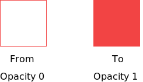

## From – To Style Animations

`renature`'s core hooks, like `useGravity`, `useFriction`, and `useFluidResistance`, operate on the notion of animating **from** a specific CSS state (i.e. `opacity: 0`) **to** a new CSS state (i.e. `opacity: 1`). In this way, the API is quite similar to [`react-spring`](https://www.react-spring.io/) and even traditional CSS `keyframes`. The difference is in the physics we use to determine how you get from one state to another.

Each force in `renature` has its own character and produces its own style of motion; depending on the effect you're trying to achieve, one force might be better suited for your needs than another. However, every force uses the same notion of a `mover` object (the object experiencing the force in our simulation) and a `force` vector. By applying the `force` vector to the `mover` object – using the equations outlined in the [Vectors](./vectors.md) sectopm – we can determine the `position` of the mover for the current frame.

We then determine where this `position` lies along the whole trajectory of the moving object's path. Is the mover halfway to its target destination? Two thirds of the way? This information helps us to determine what percentage "done" the animation is. It's almost like a physics-based version of a [tween](https://inventingwithmonster.io/20190304-how-to-write-a-tween/).

Finally, we use a technique called [linear interpolation](https://en.wikipedia.org/wiki/Linear_interpolation) to map this progress to your CSS state. For example, if the `mover` is halfway along its total trajectory, and you're animating from `opacity: 0` to `opacity: 1`, we know that the current `opacity` in the current frame should be `0.5`.

You may be asking yourself, how do we determine the trajectory of the moving object's path? What conditions do we use to say that the `mover` has reached its target destination? To understand this better, read more on the [**Simulate**](./the-lifecycle-of-an-animation.md#simulate) step of `renature`'s animation lifecycle.
