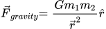
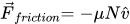

## The Lifecycle of an Animation

The lifecycle of an animation in `renature` can be thought of as occuring in three stages:

- [**Simulate**](#simulate) – run a physics simulation for the selected force using the user-supplied configuration.
- [**Interpolate**](#interpolate) – map the `position` vector of the simulation to a CSS value between `from` and `to`.
- [**Animate**](#animate) – update the target element's styling according to the results of the Interpolate step.

We discuss these phases in detail below.

### Simulate

The first step in a `renature` animation is to start the backing physics simulation in the `requestAnimationFrame` loop. This is what allows us to expose our `mover` object to the selected `force` vector. We then observe the changing `position` of the `mover` object over time as the `force` acts on it.

To track the `position` of the mover we use a standard Cartesian coordinate system, with the mover always beginning at the origin (0, 0). We also determine, before the animation ever runs, the ending position for the `mover`. This ending position varies force by force, and is based off a particular physics condition achieved by our simulations.

#### The Gravity Simulation

The `useGravity` hook implements a backing physics simulation that involves a `mover` object being pulled towards an `attractor` object. The `mover` is assumed to start at rest, gradually accelerating as it gets pulled towards the `attractor`. To simplify the simulation, we only apply the gravitational force of the `attractor` on the `mover`. Once the `mover` has reached the `attractor`, we end the simulation and stop the animation. At this point, your animating element will have reached the `to` CSS state specified in your configuration.

The force of gravity is calculated using Newton's law of universal gravitation.




#### The Friction Simulation

For `useFriction`, the backing simulation involves a `mover` object sliding across a rough surface. The `mover` is assumed to have an initial velocity, provided by the user configuration. We also account for the strength of the normal force in this simulation using the acceleration of gravity at Earth's surface (approximately 9.80665 m/s²). Once the `mover` has come to rest on the surface – indicated by a `velocity` vector of `(0, 0)` – we end the simulation and stop the animation. We use a variant of the [kinematic equations](https://www.khanacademy.org/science/physics/one-dimensional-motion/kinematic-formulas/a/what-are-the-kinematic-formulas) to derive the `position` at which the `mover` will come to rest. At this point, your animating element will have reached the `to` CSS state specified in your configuration.

The force of friction is calculated as follows.



And we use this variant of the fourth kinematic equation to calculate position when the `mover`'s velocty vector is `(0, 0)`.


#### The Fluid Resistance Simulation

For `useFluidResistance`, the backing simulation involves dropping the `mover` object from rest into a fluid of density ρ. The `mover` object experiences the force of gravity acting at the Earth's surface in one direction and the force of drag in the other. As the `mover` continues to fall through the fluid, it will eventually reach [terminal velocity](https://en.wikipedia.org/wiki/Terminal_velocity), the speed at which the net acceleration on the `mover` is 0. At this point, your animating element will have reached the `to` CSS state specified in your configuration. For cases where the `settle` parameter is provided, reaching terminal velocity will actually result in the `mover` colliding with a surface and rebounding with a linear backoff.


### Interpolate

`renature`'s physics simulations provide highly accurate `position` vectors and also set a **range** for the `mover`'s total trajectory. The **Interpolate** stage takes this information and maps it to an output **domain** represented by the `from` and `to` boundaries of your CSS property.

Let's look at an example. Say you want to animate your element using the `useGravity` hook. We determine the **range** of your animation by looking at the `r` parameter you provided to `useGravity`.

```typescript
const GravityBasic: React.FC = () => {
  const [props] = useGravity<HTMLDivElement>({
    from: { opacity: 0, transform: 'translateX(0px) scale(0.5)' },
    to: { opacity: 1, transform: 'translateX(100px) scale(2)' },
    config: {
      moverMass: 10000,
      attractorMass: 1000000000000,
      r: 75, // The range of the physics simulation will be (0, 75).
    },
  });

  return <div {...props} />;
};
```

We then look at the `from` and `to` properties you provided to `useGravity` and build an output **domain**. In the above example we have three output domains:

```reason
let domainOpacity = (0, 1);
let domainTranslateX = (0, 100);
let domainScale = (0.5, 2);
```

Using linear interpolation, we can determine where along the `mover`'s path we are. Let's say we're at `position` `(25, 0)`, a third of the way to our ending position. With this information, we can interpolate a CSS value in each output **domain**.

```reason
let opacity = 25. /. 75. *. (1. -. 0.) +. 0. = 0.333;
let translateX = 25. / 75. *. (100. -. 0.) +. 0. = 33.3;
let scale = 25. /. 75. *. (2. -. 0.5) +. 0.5 = 1.;
```

In this way we can interpolate a `position` in our physics simulation to a CSS value between user-supplied `from` and `to` states, smoothly animating your elements from one to the other. We run these calculations on every frame the browser renders using `requestAnimationFrame`.

### Animate

The final step in a `renature` animation involves applying the interpolated CSS to your animating element. To do this we use a [mutable `ref` object](https://reactjs.org/docs/hooks-reference.html#useref) and update its `style` property on every animation frame as we receive a new interpolated value (see above).

We use a mutable `ref` and the `style` property to avoid storing animation information in React state. If we were triggering state updates on every frame, React would be attempting to re-render your component on every frame, quickly resulting in laggy, sluggish animations. While the reconciliation process is quite fast, it's not fast enough to give us a consistent 60 frames per second.

This technique is used by similar libraries like `react-spring` and `animated`, although they vendor their own node type to handle a wider variety of render targets. `renature` currently operates on the web only.
