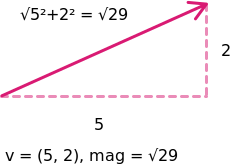
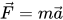
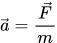
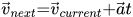
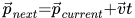

## Vectors

`renature` uses two-dimensional vectors as the core data type for running our physics simulations. [Vectors](https://natureofcode.com/book/chapter-1-vectors/) are mathematical objects that have both magnitude and direction, and are typically represented in two dimensions using a directed line.



When modeling real-world motion in two dimensions, vectors are particularly useful. We can use vectors to represent where an object is in space (`position`), how fast an object is moving through space (`velocity`), and the rate of change of its speed (`acceleration`). `renature` tracks each of these motion vectors in animation state to determine how an object moves over time.

We use [ReScript](https://rescript-lang.org/) to model vectors in `renature`, using a data structure called a [tuple](https://rescript-lang.org/docs/manual/latest/tuple).

```reason
/* A moving object located at x: 5m, y: 10m in our coordinate system. */
let position = (5., 10.)

/* An object moving at -0.5m/s in the x direction and 2m/s in the y direction. */
let velocity = (-0.5, 2.)

/* An object decelerating at -0.1 m/s^2 in the x direction and
accelerating at 0.005 m/s^2 in the y direction. */
let acceleration = (-0.1, 0.005)
```

Forces can be modeled as vectors as well. Forces have a magnitude (how strong the force is) and a direction (the path the force is acting along).

```reason
let force = (-5., -2.)
```

With this knowledge of a moving object's motion vectors and an external force vector, we can determine how applying a force onto a moving object will alter that object's `acceleration`, `velocity`, and `position`. To do that, we use the following equations from Newtonian physics.









With just these laws, we can build a comprehensive model of motion in two dimensions. To learn more, check out Daniel Shiffman's excellent writing on [Vectors](https://natureofcode.com/book/chapter-1-vectors/) or read [the source](https://github.com/FormidableLabs/renature/blob/saturn/src/core/Vector.res) for our vector math.
